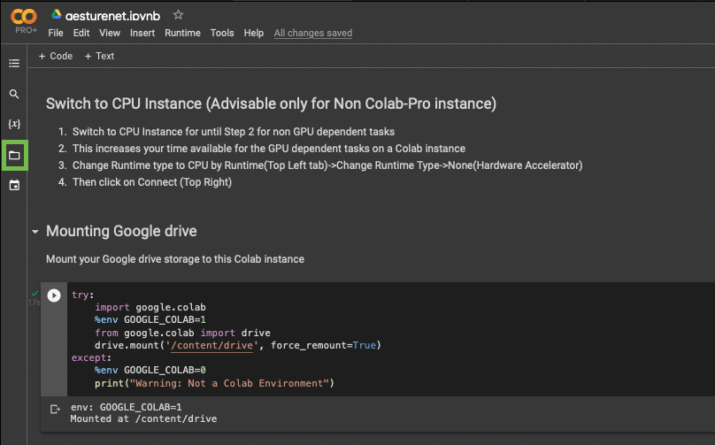
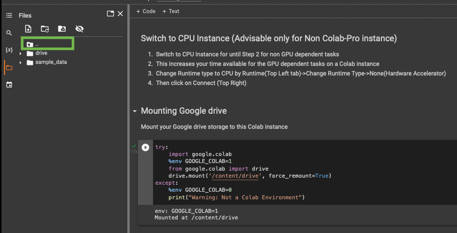
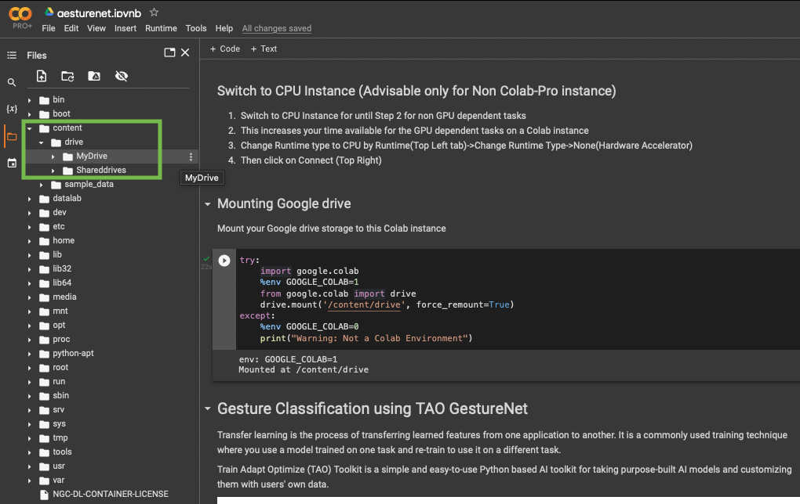

# Running TAO Toolkit on Google Colab

Google Colab provides access to free GPU instances for running compute jobs
in the cloud. This page provides instructions for getting started with TAO Toolkit on 
Google Colab.

Google Colab has some restrictions with TAO based on the limitations of the hardware and
software available with the Colab Instances. You can view the limitations in the
[Notes](#head-1) section.

<br>

## Pre-Requisites

To use Google Collab, you'll need a Google Account with Google Drive access.

Log in to your Google account,or create one by following instructions on the
[Sign-Up for Gmail page](https://accounts.google.com/signup/v2/webcreateaccount?flowName=GlifWebSignIn&flowEntry=SignUp)

<br>

## Launching Notebooks with Google Colab

TAO Toolkit provides an extensive model zoo containing pretrained models for both computer-vision
and conversational AI use cases. You can click on the "One-Click Deploy" link for the model of your
use-case.

Refer to the [Steps to Locate files in a Colab Notebook](#head-2) section for an example
of accessing files within the Colab notebook.

<br>

### General-Purpose Computer Vision Models

With general purpose models, you can train an image classification model, object detection model,
or an instance segmentation model.

|Model Name                       |One-Click Deploy|Action                                                                                                                                               |
|---------------------------------|----------------|-----------------------------------------------------------------------------------------------------------------------------------------------------|
|Multi-class Image Classification |[Multi-class Image classification](https://colab.research.google.com/github/NVIDIA-AI-IOT/nvidia-tao/blob/main/tensorflow/classification/classification.ipynb)|Classification                                                                                                                                       |
|Multi-task Image Classification  |[Multi-task Image Classification](https://colab.research.google.com/github/NVIDIA-AI-IOT/nvidia-tao/blob/main/tensorflow/multitask_classification/multitask_classification.ipynb)|Classification                                                                                                                                       |
|DSSD                             |[Object Detection using Deformable DSSD](https://colab.research.google.com/github/NVIDIA-AI-IOT/nvidia-tao/blob/main/tensorflow/dssd/dssd.ipynb)|Object Detection                                                                                                                                     |
|EfficientDet                     |[Object Detection using EfficientDet](https://colab.research.google.com/github/NVIDIA-AI-IOT/nvidia-tao/blob/main/tensorflow/efficientdet/efficientdet.ipynb)|Object Detection                                                                                                                                     |
|RetinaNet                        |[Object Detection using RetinaNet](https://colab.research.google.com/github/NVIDIA-AI-IOT/nvidia-tao/blob/main/tensorflow/retinanet/retinanet.ipynb)|Object Detection                                                                                                                                     |
|SSD                              |[Object Detection using SSD](https://colab.research.google.com/github/NVIDIA-AI-IOT/nvidia-tao/blob/main/tensorflow/ssd/ssd.ipynb)|Object Detection                                                                                                                                     |
|Yolo V3                          |[Object Detection using Yolo V3](https://colab.research.google.com/github/NVIDIA-AI-IOT/nvidia-tao/blob/main/tensorflow/yolo_v3/yolo_v3.ipynb)|Object Detection                                                                                                                                     |
|Yolo V4                          |[Object Detection using Yolo V4](https://colab.research.google.com/github/NVIDIA-AI-IOT/nvidia-tao/blob/main/tensorflow/yolo_v4/yolo_v4.ipynb)|Object Detection                                                                                                                                     |
|Yolo V4 Tiny                     |[Object Detection using Yolo V4 Tiny](https://colab.research.google.com/github/NVIDIA-AI-IOT/nvidia-tao/blob/main/tensorflow/yolo_v4_tiny/yolo_v4_tiny.ipynb)|Object Detection                                                                                                                                     |

<br>

### Purpose-Built Computer Vision Models

Purpose-built models are built for high accuracy and performance. You can deploy these models out of
the box for applications such as smart city, retail, public safety, and healthcare. You can also
retrain them with your own data.

|Model Name           |One-Click Deploy|Purpose                                                                                                                                              |
|---------------------|----------------|-----------------------------------------------------------------------------------------------------------------------------------------------------|
|ActionRecognitonNet  |[Action Recognition](https://colab.research.google.com/github/NVIDIA-AI-IOT/nvidia-tao/blob/main/pytorch/cv_notebooks/action_recognition_net/actionrecognitionnet.ipynb)|Detecting actions from videos                                                                                                                        |
|LPRNET               |[License Plate Recognition](https://colab.research.google.com/github/NVIDIA-AI-IOT/nvidia-tao/blob/main/tensorflow/lprnet/lprnet.ipynb)|Recognize License plates numbers                                                                                                                     |
|HeartRateNet         |[Heart Rate Estimation](https://colab.research.google.com/github/NVIDIA-AI-IOT/nvidia-tao/blob/main/tensorflow/heartratenet/heartratenet.ipynb)|Estimates person's heartrate from RGB video                                                                                                          |
|GestureNet           |[Gesture Recognition](https://colab.research.google.com/github/NVIDIA-AI-IOT/nvidia-tao/blob/main/tensorflow/gesturenet/gesturenet.ipynb)|Recognize hand gestures                                                                                                                              |
|EmotionNet           |[Emotion Recognition](https://colab.research.google.com/github/NVIDIA-AI-IOT/nvidia-tao/blob/main/tensorflow/emotionnet/emotionnet.ipynb)|Recognize facial Emotion                                                                                                                             |
|PoseClassificationNet|[Pose Classification](https://colab.research.google.com/github/NVIDIA-AI-IOT/nvidia-tao/blob/main/pytorch/cv_notebooks/pose_classification_net/poseclassificationnet.ipynb)|Classify poses of people from their skeletons                                                                                                        |

<br>

### Conversational AI Models

|One-Click Deploy                                                                                                                             |Base Architecture|Dataset                                                                                                                                              |Purpose                                                                                                                                                                                                                                                                                                                                                           |
|---------------------------------------------------------------------------------------------------------------------------------------------|-----------------|-----------------------------------------------------------------------------------------------------------------------------------------------------|------------------------------------------------------------------------------------------------------------------------------------------------------------------------------------------------------------------------------------------------------------------------------------------------------------------------------------------------------------------|
|[Language Model](https://colab.research.google.com/github/NVIDIA-AI-IOT/nvidia-tao/blob/main/pytorch/convai_notebooks/ngram_lm/n-gram-training.ipynb)                                |N_Gram          |Librispeech LM                                                         |Language modeling                                                                                                                                                                                                                                                                                                                                              |
|[Speech to Text English QuartzNet](https://colab.research.google.com/github/NVIDIA-AI-IOT/nvidia-tao/blob/main/pytorch/convai_notebooks/speechtotext/speech-to-text-training.ipynb)                             |Quartznet        |ASR Set 1.2                                                                                                                                          |Speech Transcription                                                                                                                                                                                                                                                                                                                                              |
|[Speech to Text English CitriNet](https://colab.research.google.com/github/NVIDIA-AI-IOT/nvidia-tao/blob/main/pytorch/convai_notebooks/speechtotext_citrinet/speech-to-text-training.ipynb)                            |CitriNet         |ASR Set 1.4                                                                                                                                          |Speech Transcription                                                                                                                                                                                                                                                                                                                                              |
|[Speech to Text English Conformer](https://colab.research.google.com/github/NVIDIA-AI-IOT/nvidia-tao/blob/main/pytorch/convai_notebooks/speechtotext_conformer/speech-to-text-training.ipynb)                          |Conformer        |ASR Set 1.4                                                                                                                                          |Speech Transcription                                                                                                                                                                                                                                                                                                                                              |
|[Text to Speech](https://colab.research.google.com/github/NVIDIA-AI-IOT/nvidia-tao/blob/main/pytorch/convai_notebooks/texttospeech/text-to-speech-finetuning-cvtool.ipynb)                          |Conformer        |ASR Set 1.4                                                                                                                                          |Speech Transcription                                                                                                                                                                                                                                                                                                                                              |
|[Question Answering SQUAD2.0 Bert](https://colab.research.google.com/github/NVIDIA-AI-IOT/nvidia-tao/blob/main/pytorch/convai_notebooks/questionanswering/question-answering-training.ipynb)                            |BERT             |SQuAD 2.0                                                                                                                                            |Answering questions in SQuADv2.0, a reading comprehension dataset consisting of Wikipedia articles.                                                                                                                                                                                                                                                               |
|[Named Entity Recognition Bert](https://colab.research.google.com/github/NVIDIA-AI-IOT/nvidia-tao/blob/main/pytorch/convai_notebooks/tokenclassification/token-classification-training.ipynb)                        |BERT             |GMB (Gronigen Meaning Book)                                                                                                                          |Identifying entities in a given text (Supported Categories: Geographical Entity, Organization, Person , Geopolitical Entity, Time Indicator, Natural Phenomenon/Event)                                                                                                                                                                                            |
|[Joint Intent and Slot Classification Bert](https://colab.research.google.com/github/NVIDIA-AI-IOT/nvidia-tao/blob/main/pytorch/convai_notebooks/intentslotclassification/intent-slot-classification-training.ipynb)  |BERT             |Proprietary                                                                                                                                          |Classifying an intent and detecting all relevant slots (Entities) for this Intent in a query. Intent and slot names are usually task specific. This model recognizes weather related intents like weather, temperature, rainfall etc. and entities like place, time, unit of temperature etc. For a comprehensive list, please check the corresponding model card.|
|[Punctuation and Capitalization Bert](https://colab.research.google.com/github/NVIDIA-AI-IOT/nvidia-tao/blob/main/pytorch/convai_notebooks/punctuationcapitalization/punctuation-and-capitalization-training.ipynb)               |BERT             |Tatoeba sentences, Books from the Project Gutenberg that were used as part of the LibriSpeech corpus, Transcripts from Fisher English Training Speech|Add punctuation and capitalization to text.                                                                                                                                                                                                                                                                                                                       |
|[Domain Classification English Bert](https://colab.research.google.com/github/NVIDIA-AI-IOT/nvidia-tao/blob/main/pytorch/convai_notebooks/textclassification/text-classification-training.ipynb)                     |BERT             |Proprietary                                                                                                                                          |For domain classification of queries into the 4 supported domains: weather, meteorology, personality, and none.                                                                                                                                                                                                                                                   |


<br>

### TAO Pre-trained Models (Inference Only)

In addition to training different models using the one-click deploy links, you can run inference with the
Pre-trained Models TAO has published using [this Notebook](https://colab.research.google.com/github/NVIDIA-AI-IOT/nvidia-tao/blob/main/tao_deploy/tao_deploy.ipynb)

<br>

## Utility scripts to obtain subset of data

If you have limited storage space, or want to iterate quickly through training experiments, it is advised to carry out the following:

* Download data on to your local system

* Run a utility script to generate a subset of the dataset

* Upload this smaller dataset to your Google Drive to run experiments on

TAO Toolkit provides utility scripts to generate such subsets for COCO dataset (which is around ~25 GB with ~120k images) and KITTI dataset (which is around ~12 GB with ~14k images)

<br>

### To obtain subset for KITTI:

* The subset generation file is present [here](https://github.com/NVIDIA-AI-IOT/nvidia-tao/blob/main/tensorflow/utils/generate_kitti_subset.py). Run this script in your local system (not in Colab as you might have storage limitations)

* Download and unzip kitti training and testing zip files [here](https://www.cvlibs.net/datasets/kitti/eval_object.php?obj_benchmark=2d), you'll have 2 folders training and testing

* To obtain subset for training:

  ```
  python generate_kitti_subset.py --source-data-dir=path_to_training_folder --out-data-dir=path_to_save_subset_data/training/ --training True --num-images=num_of_images_in_subset
  ```

  Example

  ```
  python generate_kitti_subset.py --source-data-dir=/home/user/data/training --out-data-dir=/home/user/subset_data/training/  --training True --num-images=100
  ```

* To obtain subset for testing:

  ```
  python generate_kitti_subset.py --source-data-dir=path_to_training_folder --out-data-dir=path_to_save_subset_data/training/ --num-images=num_of_images_in_subset
  ```

  Example

  ```
  python generate_kitti_subset.py --source-data-dir=/home/user/data/testing --out-data-dir=/home/user/subset_data/testing/ --num-images=100
  ```

Dataset folder structure for kitti:

```
  path_to_training_folder
  |___image_2
  |___label_2

  path_to_testing_folder
  |___image_2
```

<br>

### To obtain subset for COCO:

* The subset generation file is present [here](https://github.com/NVIDIA-AI-IOT/nvidia-tao/blob/main/tensorflow/utils/generate_coco_subset.py). Run this script in your local system (not in Colab as you might have storage limitations)

* Download and unzip 2017 train and val images, 2017 train/val annotations from [here](https://cocodataset.org/#download)

* To obtain subset for training:

  ```
  python generate_coco_subset.py --source-image-dir=path_to_train2017_folder --source-annotation-file=path_to_instances_train2017.json_file --out-data-dir=path_to_save_subset_data --num-images=num_of_images_in_subset
  ```

  Example

  ```
  python generate_coco_subset.py --source-image-dir=/home/user/data/train2017 --source-annotation-file=/home/user/data/annotations/instances_train2017.json --out-data-dir=/home/user/subset_data/ --num-images=100
  ```

* To obtain subset for validation:

  ```
  python generate_coco_subset.py --source-image-dir=path_to_val2017_folder --source-annotation-file=path_to_instances_val2017.json_file --out-data-dir=path_to_save_subset_data --num-images=num_of_images_in_subset
  ```

  Example

  ```
  python generate_coco_subset.py --source-image-dir=/home/user/data/val2017 --source-annotation-file=/home/user/data/annotations/instances_val2017.json --out-data-dir=/home/user/subset_data/ --num-images=100
  ```

Dataset folder structure for coco:

```
  folder_into_which_downloaded_coco_files_are_unzipped
  |___train2017
  |___val2017
  |___annotations
      |___instances_train2017.json
      |___instances_val2017.json
```

<br>

## Steps to Locate Files in a Colab Notebook <a class="anchor" id="head-2"></a>

1. Mount the drive in the Colab Instance.

2. Click on the folder icon (shown within the green box)



3. Click on the 'move up one folder' icon (shown within the green box)



* Now you can view all folders that are tied to this instance.

* The google drive you mounted is present at **content->drive->MyDrive**.

* All the folders listed in the below screenshot are folders in the root directory "/".



<br>

## Notes <a class="anchor" id="head-1"></a>

* Conversational AI pretrained backbones that use Megatron can't run on Colab/ColabPro instances
  because they need more than 24GB of GPU RAM.

* The following TAO networks can't run on Colab until Colab has updated its drivers to 515 or above:
  Detectnetv2, BPNET, FasterRCNN, FPNet, and Gazenet.

* Any folder  that is not in ``/content/drive/MyDrive/`` will be a volatile path: You'll lose access
  to the contents when the session disconnects

* If you have a 15GB drive storage limit, try setting the data folder to ``/content/data/data_you_are_downloading``
  instead of using the drive at ``/content/drive/MyDrive``.

  * This is preferred because volatile storage is greater than 15G.B

  * You can also upload a file downloaded on your system to ``/content/data`` using the drag-and-drop method.

* The browser tab needs to be active for the duration of a Colab session. To keep the Colab instance active in
  the background, you can use a third party extension like [Colab Alive](https://chrome.google.com/webstore/detail/colab-alive/eookkckfbbgnhdgcbfbicoahejkdoele?hl=en-GB).

* In Tensorflow notebooks, to maximize GPU usage, you can switch to GPU hardware only after
  completing the data download and preprocessing steps that doesn't require a GPU:

  * At the point of switching to a GPU instance, it is fine to terminate the previous instance.

  * You can keep running sucessive cells without rerruning any of the previous cells, with the following exceptions:

    * If some data was saved in the volatile storage instead of the Google Drive storage, then switching instances
      will delete the data.

    * In such cases, the data must be backed up to Google Drive before terminating. This can be achieved with a simple
      Linux copy command: 
      ```
      cp path_to_volatile_storage /content/drive/MyDrive/folder_to_be_copied_into 
      ```

* With the free version of Colab, GPU instances can run a maximum of 8 hours.

* With the free version of Colab, only one GPU instance notebook can run at a time.

  * Colab Pro can run two GPU instance notebooks simultaneously.

* Colab does not allow you to choose the GPU type.

  * As of November 2022, the predominant GPU is a Tesla T4 with the free version and a P100 with
    Colab Pro.
